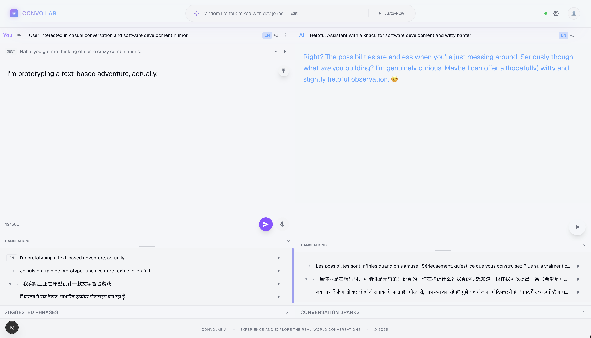

# ConvoLab

ConvoLab is an AI-powered platform for conversation and notebook building. It helps users explore ideas through guided, simulated conversations.

> **To help people learn, explore, and document ideas through AI-driven conversations**.

**🌐 Live Website:** [https://convolab.xyz](https://convolab.xyz)

## Demo

Screenshot of the UI:
| Dark Mode | Light Mode |
| :---: | :---: |
|  |  |

Demo Video:
https://github.com/user-attachments/assets/0d422e4f-ffe1-4677-b5b8-4310a81123e4


## Application Overview

ConvoLab focuses on AI-driven conversations and notebook creation. You start with a prompt or scenario, explore ideas through guided, simulated dialogue, and then turn the results into a structured notebook.

### Key Capabilities

-   **Guided Conversations**:
    -   Start from a prompt or context and let the AI drive a focused discussion.
    -   Keep the thread going with smart follow-ups and suggested directions.

-   **Notebook Builder**:
    -   Capture key points from a conversation and organize them into a notebook.
    -   Iterate on the notebook as the conversation evolves.

-   **Conversation History**:
    -   Review previous conversations and reuse them as context.

## Architecture & UI Design

ConvoLab is built as a highly responsive **Single Page Application (SPA)** using **Next.js 14**. The architecture prioritizes low-latency state updates to keep conversations and notebook edits fluid.

### Tech Stack

-   **Framework**: Next.js 14 (App Router)
-   **Language**: TypeScript
-   **Styling**: Tailwind CSS (with custom extensive config for dark mode aesthetics)
-   **Animation**: Framer Motion (for smooth micro-interactions and transitions)
-   **State Management**: React Hooks (Custom-built for conversation logic)
-   **Audio**: Web Audio API (Visualization) + Custom hooks for STT/TTS integration

### Modular Component Architecture

The frontend is structured around reusable components that manage their own isolated states while communicating via a central context.

```
components/
├── input/             # Prompt and context input modules
│   └── ContextInput   # Scenario and prompt entry
├── shared/            # Shared UI elements
│   ├── ConversationHistoryModal
│   └── NotebookBuilderModal
├── offline/           # Offline and model selection utilities
│   └── ModelSelector
```

## Integration

While the focus is on the rich UI, the frontend connects to a localized or cloud-based backend via REST APIs.

-   **Streaming**: Responses can be streamed to the client to minimize perceived latency.

## Getting Started

### Prerequisites

-   **Node.js**: v18+
-   **Backend Running**: (See Backend README for setup)

### Installation

1.  **Install Dependencies**
    ```bash
    npm install
    ```

2.  **Environment Setup**
    Copy the example credentials:
    ```bash
    cp .env.example .env.local
    ```

3.  **Run Development Server**
    ```bash
    npm run dev
    ```

4.  **Launch**
    Visit [http://localhost:3000](http://localhost:3000).

## Contributing

We are constantly refining the UI/UX. If you have ideas for better visualization or smoother interaction flows, please open a PR!

## License

[MIT](LICENSE)

